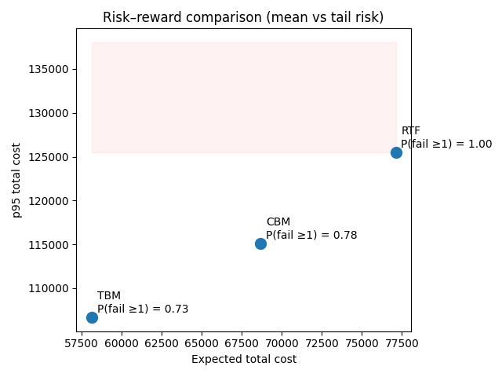
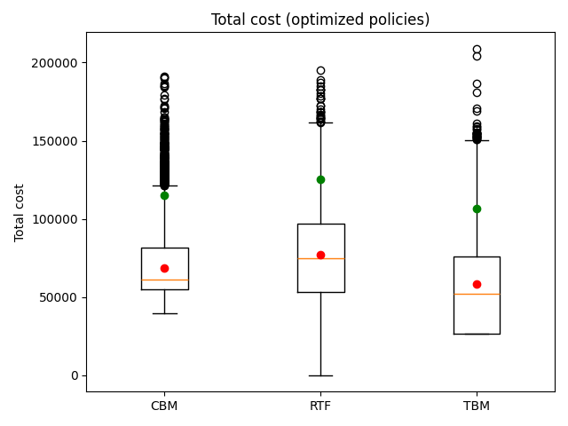
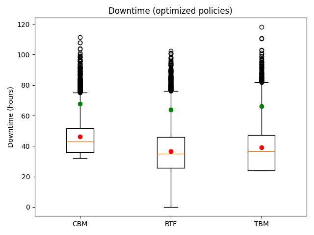

# Choosing a Maintenance Policy Under Failure Uncertainty

## Decision Intelligence Case Study  
**Simulation, risk-aware optimisation, and policy comparison**

---

## 1. Context & Motivation

Maintenance decisions for critical assets are rarely about *predicting* failures perfectly.  
They are about **choosing a policy** that balances:

- expected cost  
- operational risk  
- downtime exposure  
- uncertainty in failure and repair processes  

This project studies a **maintenance policy selection problem under uncertainty**, using Monte Carlo simulation and risk-adjusted optimisation to support defensible decisions.

The goal is not to build a predictive maintenance model, but to answer:

> *“Given uncertainty, which maintenance policy should we choose — and why?”*

---

## 2. Decision Problem

A company operates a critical asset over a fixed planning horizon.

Failures are:
- stochastic (random failure times)  
- costly (repair cost, downtime, penalties)  

Maintenance actions:
- reduce failure risk  
- incur direct cost and downtime  

The decision-maker must choose **one maintenance policy**.

---

## 3. Policies Evaluated

### **RTF — Run to Failure**
- No preventive actions  
- Corrective maintenance only after failure  
- Lowest preventive cost, highest risk  

### **TBM — Time-Based Maintenance**
- Preventive maintenance at fixed calendar intervals  
- Deterministic schedule  
- Stable but potentially over-conservative  

### **CBM — Condition-Based Maintenance**
- Periodic inspections  
- Maintenance triggered when a condition proxy exceeds a threshold  

In this simplified model:
- **Condition = age since last reset**  
- Threshold defines how conservative the policy is  

CBM interpolates naturally between TBM-like behaviour and RTF-like behaviour.

---

## 4. Modelling & Evaluation Approach

- Renewal-process simulation model  
- Failure time: Weibull distribution  
- Repair duration: Lognormal distribution  

Each policy is evaluated using **Monte Carlo simulation**, producing full cost and downtime distributions rather than single-point estimates.

Policies are compared using a **risk-adjusted objective**:

J = mean cost + λ · P(failure ≥ 1)

where λ represents risk aversion.

---

## 5. Policy Optimisation

The main decision parameters are optimised before comparison:

- **TBM**: preventive maintenance interval  
- **CBM**: condition threshold (days since last reset)  

A two-stage grid search (coarse → refined) is used to ensure:
- transparency  
- robustness to Monte Carlo noise  
- full explainability of results  

---

## 6. Optimised Policy Comparison

After optimisation, the **best TBM and CBM configurations** are compared against each other and against the RTF baseline under identical uncertainty assumptions.

### Risk–Reward Comparison

### Cost Distribution

### Downtime Distribution

---

## 7. Decision Recommendation (Quantitative)

The table below summarises the performance of the optimised policies (Monte Carlo results):

- **RTF (Run to Failure)**  
  - Mean cost: **€77.1k**  
  - Failure probability: **~100%**  
  - p95 cost: **€125.5k**  

- **CBM (Condition-Based Maintenance)**  
  - Mean cost: **€68.7k**  
  - Failure probability: **77.6%**  
  - p95 cost: **€115.1k**  
  - ~10.6 inspections and ~4.8 CBM actions per horizon  

- **TBM (Time-Based Maintenance)**  
  - **Lowest mean cost**: **€58.1k**  
  - **Lowest p95 cost**: **€106.7k**  
  - **Lowest failure probability**: **73.2%**  
  - Predictable workload: ~6 preventive actions per horizon  

### Final Recommendation
> **Given the assumed failure dynamics, cost structure, and risk aversion, the optimised Time-Based Maintenance (TBM) policy is the preferred option.**  
> It strictly dominates both CBM and RTF in expected cost, tail risk (p95), and failure probability, while maintaining operational predictability.

This conclusion is contingent on the stated assumptions and is therefore **transparent, testable, and defensible**.

---

## 8. Limitations & Extensions

This is a **deliberately simplified v1 model**.

Not included (yet):
- degradation state modelling  
- imperfect inspections  
- maintenance resource constraints  
- multi-asset interactions  

These omissions are intentional to preserve interpretability and decision clarity.

---

## 9. Takeaway

> **The value of maintenance analytics lies not in predicting failures, but in choosing policies that balance cost and risk under uncertainty.**

This project demonstrates how simulation and optimisation can be used as practical **Decision Intelligence tools** rather than purely predictive models.
